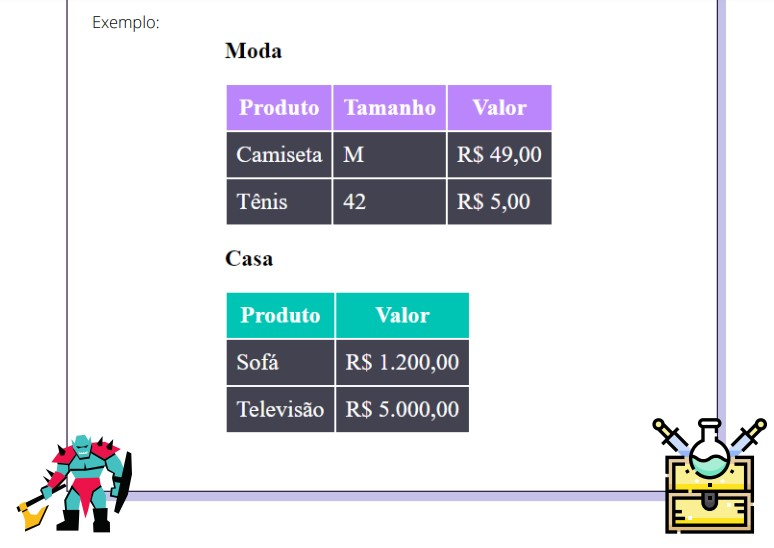

# Desafio 04 - Tabela Estilizada
Este desafio se trata da criação de duas pequenas tabelas: uma com o título "Moda" e outra com o título "Casa".

 
 

- Uma tabela de roupas com tamanho e valor da peça descrito em cada
linha.

- Cor de fundo do cabeçalho moda - #BB86FC
Cor de fundo do cabeçalho casa - #00C4B4
Cor de fundo dos valores da tabela - #424250

- Regra: não estilize usando as tags HTML, crie classes para estilizar sua tabela.
EX: .produtos-casa th { … }

## Tecnologias Utilizadas:
- HTML
- CSS